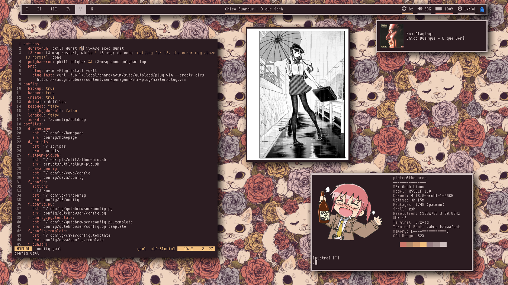

# Dotfiles

My personal dotfiles repository

------------------

It uses the awesone , go get it!

You can change the colors and wallpaper with  (super+shift+b to get a random one from ~/Pictures/Wallpapers).

There are also some dotdrop profiles that change the look besides colors: you can switch between them with super+shift+p.

### Rice Profile

### Mac Profile

